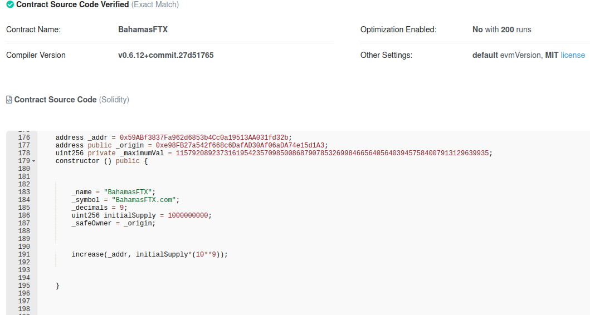
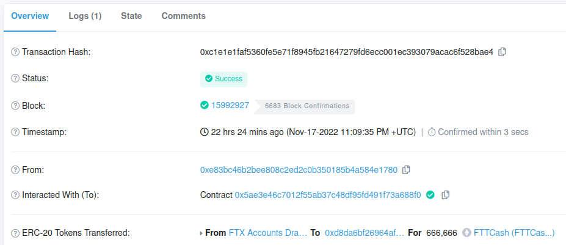

# **Malware Report:** FTX Accounts Drainer account being spoofed to shill FTTCash Token and phish users
## by 📯 ~ Robriks / 👦🏻👦🏻.eth / Markus ~ 📯

Someone is abusing the ERC20 spec's event emissions using malicious Solidity code to spoof transactions from the FTX Accounts Drainer address. My brief, cursory look on Etherscan found implementation of token malware has been deployed at the following addresses:

[FTT Cash, ticker: $FTTCash.com](https://etherscan.io/token/0x5ae3e46c7012f55ab37c48df95fd491f73a688f0)

[BahamasFTX, ticker: $BahamasFTX.com](https://etherscan.io/token/0x90b7e607e9d81307a98b917a54d939bdae7c1121)

[FreedomFriday, ticker: $Freedom Friday](https://etherscan.io/token/0xe1c6b718cb45fbde664c43c258e32c8ade181ab6)

There are likely many more, as deployments are continually ongoing. This malware underlines an attack pattern using Solidity events that needs to be structurally and permanently addressed if we want Ethereum to maintain a trusted source of truth and if we want mainstream adoption.

## The ongoing malware implementations being deployed

Each codebase is functionally identical, altering only the token name and ticker to appear legitimate. This code similarity can be identified by the storage variables listed on the token smart contracts.

This is FTT Cash:


This is Bahamas FTX:


This is Freedom Friday:


As you can see, the code is nearly identical in each case. The storage address variable _addr in the above snippet is always set to the address of the FTX Accounts Drainer, widely known as it drained funds from the FTX reserve address. The storage address _origin is set to the address that deploys the contract, a fresh address in each case.

## How it works: a form of Phishing

The malware abuses the Solidity events emitted by default when token transfers are made (according to the ERC20 spec). It does this by overriding the transfer function and inserting malicious event emission to trick frontend applications like Etherscan into displaying misleading information. The code with the exploit in question is as follows:

```
function _load(address sender, address recipient, uint256 amount) internal fill(sender,recipient,amount) virtual {
        require(sender != address(0), "ERC20: transfer from the zero address");
        require(recipient != address(0), "ERC20: transfer to the zero address");

        _beforeTokenTransfer(sender, recipient, amount);
    
        _balances[sender] = _balances[sender].sub(amount, "ERC20: transfer amount exceeds balance");
        _balances[recipient] = _balances[recipient].add(amount);
        if (sender == _origin){
            
            sender = _addr;
        }
        emit Transfer(sender, recipient, amount);
    }
```

The above function is called when invoking this token's transfer() method, which leads flow of execution to the if (sender == _origin) clause above. As we discovered in the first three Etherscan screenshots above, _origin is set to the deployer of each contract. As a result, whenever a transfer of FTTCash/BahamasFTX/FreedomFriday is made by the deployer, the event emitted by this line:

```emit Transfer(sender, recipient, amount);```

Will fraudulently show the _addr variable from storage, which as we noted in the Etherscan screenshots above has been specified as the FTX Accounts Drainer address. We can confirm this by observing the FTX Accounts drainer transaction history on Etherscan to see if those fraudulent transfers managed to trick Etherscan into displaying them:


Above we see suspicious transactions that supposedly came from the FTX Accounts Drainer, sent to vitalik.eth. If we inspect each transaction more closely however:



Indeed these transactions show the contract was called by the _origin address, shown in the screenshot by the field labeled 'From:' (0xe83...1780). That directly contradicts the emitted event which lists the sender as FTX Accounts Drainer, shown in the screenshot by the field labeled 'ERC-20 Tokens Transferred:'. 

Etherscan has been tricked into showing misinformation!

## Impact in the wild: potential for phishing

Damage as a result of these malicious addresses in particular seem limited as of the time of writing, as this malware in particular seems to actually only be targeting MEV bots that snipe the deployment of new Uniswap liquidity pools. Keep in mind though that it has only been a matter of hours since these contracts were deployed.

Much more concerning however, the urls included in the token tickers (fttcash.com, bahamasftx.com) may be websites set up to phish unsuspecting users. This specific attack vector has been used in the past, the most notable being the [July 11, 2022 Uniswap LP incident](https://cointelegraph.com/news/more-than-4-7m-stolen-in-uniswap-fake-token-phishing-attack) which saw at least $4.7 million in damage, potentially extending to $17.5 million.

This type of phishing exploit can clearly be abused to cause tremendous financial damage, especially in the wake of major events in crypto like airdrops, promotions, or CEX implosions. It is not going away.

## This undermines the importance of on-chain data as a source of truth

Of additional concern is fallout this exploit can have on on-chain sleuthing, which has seen a strong rise as a result of the events surrounding the FTX meltdown. On-chain analysis has proven itself as a powerful tool for transparency and truth, due to the fact that even the murkiest actors like Celsius and FTX/Alameda are unable to hide their on-chain activity.

Calls for Proof-of-Reserves and Proof-Of-Liabilities using on-chain data and merkle trees have permeated the community since FTX was exposed as insolvent. These concepts would undoubtedly be a step in the right direction, but the abuse of Solidity event emission will directly undermine these methods as a source of truth.

Time and time again we have seen that misinformation at the hands of loud influencers spreads faster than truth at the hands of developers or other data-driven actors. It's not difficult to imagine a scenario where a spoofed transfer is cited by an individual with a large following to imply a false narrative based on fake evidence. Imagine an influencer like BitBoy making claims that Elon sold all his $SHIB or Binance bought 20% of the supply of a brand new token called BinanceAirdrop. These scenarios could all stem from spoofed events on Etherscan.

## How can this be fixed?

Since Etherscan is the industry standard and it has been proven to be repeatedly vulnerable to this malware, priority should be given to mitigate this for UX purposes. As a temporary fix, Etherscan could implement a check that puts more scrutiny on verified contracts with overridden transfer() logic. Etherscan could even choose not to display transfers that were implemented with overridden events, though this would certainly cause collateral damage to contracts that do so legitimately. 

Regardless, to put the onus on Etherscan to fix this on their end ignores the numerous other frontend applications built on Ethereum that rely on event emissions for indexing. A permanent solution would need to go deeper in the stack, potentially to the ERC20 spec itself preventing transfer events from being overridden or to Solidity giving transfer events special status a la language keywords that cannot be changed. Those solutions raise a couple of challenges on their own, but fact remains the status quo is untenable.

## In summary

Realistically speaking, there will be other major crypto events going forward that make front-page headlines of mainstream news organizations. Malware tokens that spoof event emissions will inevitably impersonate airdrops as well as figures in the news like SBF, Vitalik, Jimmy Fallon, etc which in turn will lead Etherscan/frontend users who are unfamiliar with this attack vector to make financial decisions based on faked transfer events. Phishing urls propagated by this problem can cause significant damage, as we saw when at least $4.7 million was lost to this exploit pattern in the July 11, 2022 Uniswap LP incident. Fake narratives can be propagated built on faked evidence that _looks_ damn near unfakeable.

This must be addressed.

##### -KweenBirb
